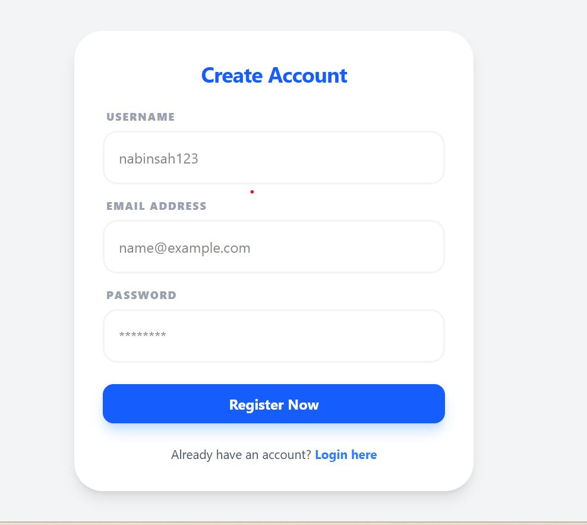
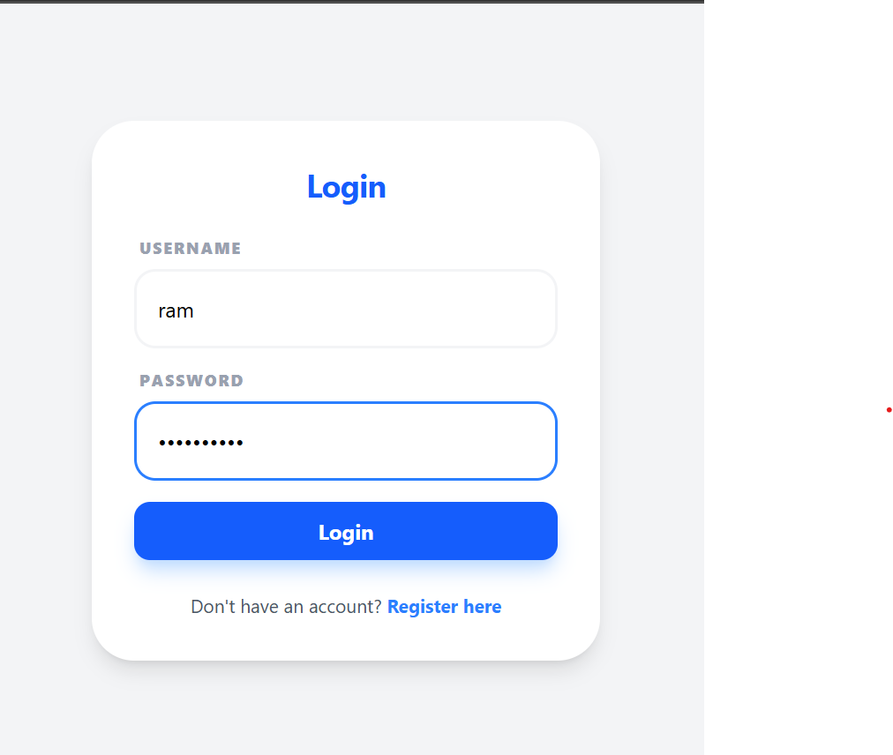
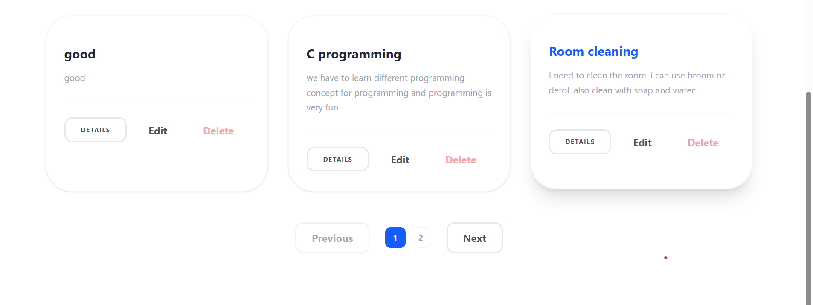
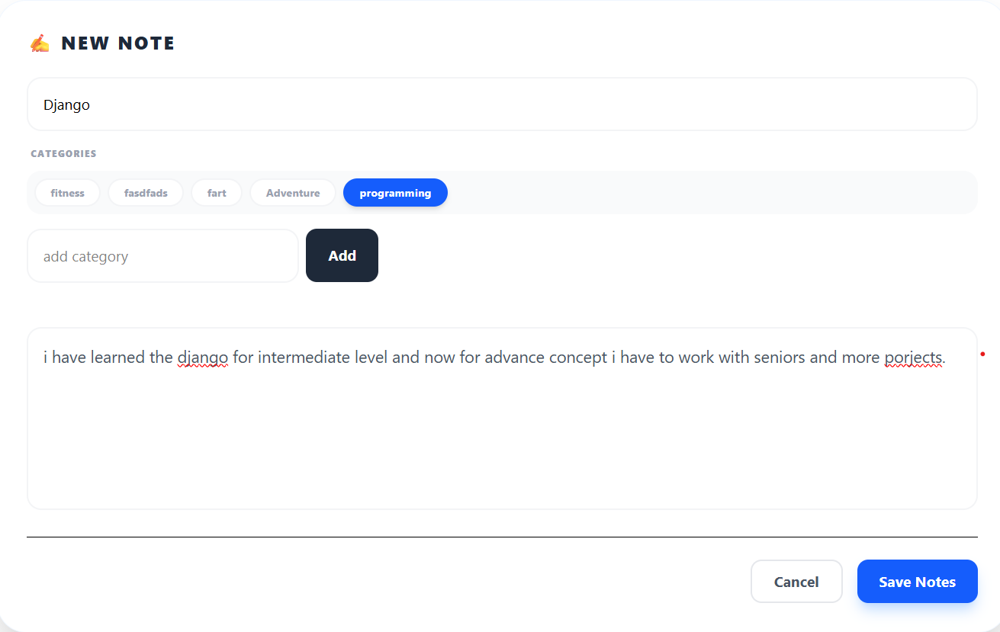
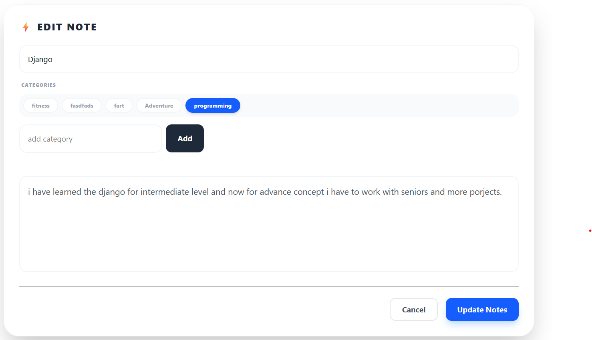

**🚀 NoteVault Frontend**

A modern, responsive note-taking application built with **React** and **Vite**. This application features full CRUD capabilities, category-based organization, and secure email verification.

**Screenshot**

**✨ Features**

**Secure Authentication:** JWT-based login and registration.

**Dynamic Dashboard:** * Search: Real-time note filtering by title or content.

**Category Filter:** Dropdown-based filtration for organized viewing.

**Sorting:** Toggle between newest, oldest, and alphabetical views.

**Responsive Design:** Fully optimized for Mobile, Tablet, and Desktop using Tailwind CSS.

**Pagination:** Efficiently handles large volumes of notes.

**🛠️ Tech Stack**

**Framework:** React.js (Vite)

**Styling:** Tailwind CSS

**Routing:** React Router DOM v6

**API Client:** Axios

**📦 Installation**

**1.Clone the repository:**
git clone https://github.com/Nabin9817/Notes_frontend.git
cd note-app-frontend

**2.Install dependencies:**
npm install 

**3.Configure Environment Variables: Create a .env file in the root directory:**
VITE_API_URL=http://localhost:8000

**4. Run Development Server:**
npm run dev

